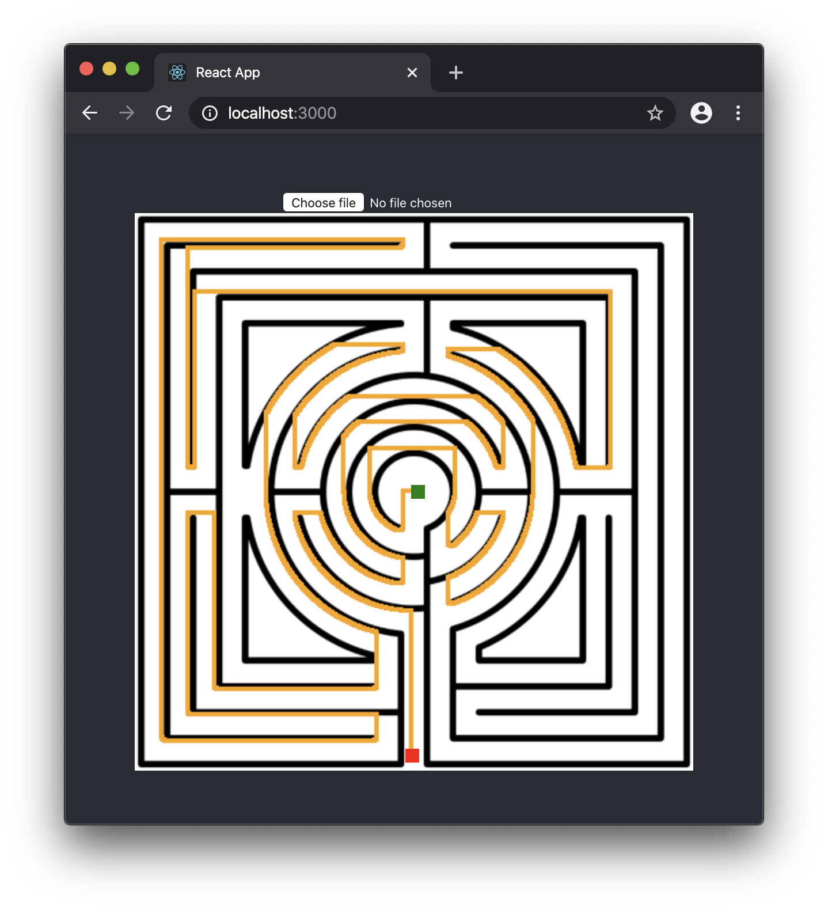
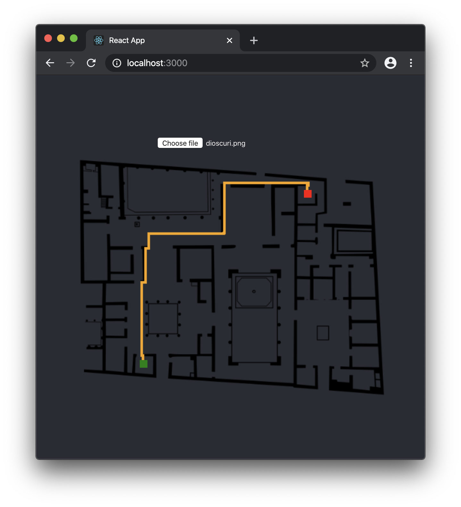

# Robot path planning system for Master's Degree in AI

- **Author**: [Antonio Sejas](https://sejas.es)
- **Demo**: https://muia-robots-path-planning.netlify.com/

## Description

The objective of this project is the implementation of a route planning system for autonomous robots. This developed planner allows us to upload any image and mark the origin and end of the route. The system will model the environment from the uploaded image. The representation model is the grid model. On the grid, all the distances to the selected destination are calculated and then the route with the shortest distance to the origin is searched. This route is shown in the image. The system is available from as a web application https://muia-robots-path-planning.netlify.com/

## Some example paths

